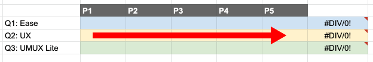
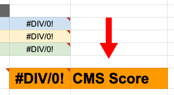

# 介绍和目标
类别成熟度 (CM) 记分卡是一种 [总结性评估](https://www.nngroup.com/articles/formative-vs-summative-evaluations/) ，它考虑了待完成工作 (JTBD) 所定义的整个体验，而不是通常通过 [可用性测试](https://about.gitlab.com/handbook/engineering/ux/ux-research-training/usability-testing/) （即解决方案验证）来衡量的个人改进. 这个专门的过程提供了数据来帮助我们对产品的成熟度进行评级。
此过程的目标是在时间和资源有限的情况下尽可能客观地生成数据。出于这个原因，这个过程比其他用户体验研究方法更严格，它更多地关注措施而不是思想和口头反馈。
为了产生我们有信心的数据，数据应该尽可能没有主观判断，依赖于观察到的指标和自我报告的用户情绪。我们的目标是比较一段时间内的数据，以了解添加和改进如何以可量化的方式影响产品成熟度。为促进这一点，我们制定了此流程，以便所有产品设计师在我们产品的所有类别中始终如一地应用它。

# 要记住的一些事情
有时，您需要评估的 JTBD 会在一段时间内发生，例如响应警报时的多步骤过程。对于这些情况，在 CM 记分卡场景中进入 JTBD 的下一阶段时，包含短语“（一段时间）已经过去”是合适的。
有时，团队会遇到这样的情况，他们从 CM 记分卡中学到了一些令人惊讶的东西——例如，即使这个单一研究计划的分数足够高，可以提升成熟度，但根据调查结果，他们认为它还没有准备好。在这种情况下，产品经理和产品设计师应该在改变成熟度之前利用他们对解决基本问题的良好判断，并将该决定传达给利益相关者。
如果您有任何问题、改进建议，或发现此过程不符合您的用户或产品类别的需求，请联系您所在小组的 UX 研究员。
任何类别成熟度记分卡工作都应该在 GitLab UX 研究项目中创建相应的issue。确保将标签CM Scorecard应用于问题以帮助跟踪用户体验研究工作。

请参阅 [类别成熟度](https://about.gitlab.com/direction/maturity/) 页面以了解评分。需要注意的是：
* **Minimal：**的类别到期记分卡*不是*必需的。
* **Viable：**类别成熟度记分卡由内部用户进行测试。
* **Complete and Lovable：**类别成熟度记分卡是在 JTBD 上与外部用户一起进行的。

# UX 记分卡与类别成熟度记分卡的关系
在 [UX 记分卡](https://about.gitlab.com/handbook/engineering/ux/ux-scorecards/#how-ux-scorecards-relate-to-category-maturity-scorecards) 手册页面中了解记分卡与类别成熟度记分卡的关系。
所有 UX 记分卡都可以在这个 [史诗中](https://gitlab.com/groups/gitlab-org/-/epics/1714) 找到。

# 第 0 步：要完成的工作 (JTBD)
类别成熟度记分卡是关于根据**定义和自信的**JTBD判断体验质量。JTBD 是我们产品设计过程的主要组成部分，用作指导我们的产品策略及其组成的功能的指南。因此，在完成类别成熟度记分卡之前，应该定义该类别的 JTBD 并具有高度的信心。
请参阅 [JTBD 页面](https://about.gitlab.com/handbook/engineering/ux/jobs-to-be-done/) 以了解 [如何编写 JTBD](https://about.gitlab.com/handbook/engineering/ux/jobs-to-be-done/#how-to-write-jtbd) 。
在进入第 1 步之前，您首先需要选择几个与您的类别特征相关的高优先级工作陈述，并将它们转换为脚本场景。理想情况下，每个类别成熟度记分卡研究不应测试超过 2 个工作陈述。每个作业语句使用的场景数量通常取决于所测试功能的复杂性。
提示：由于工作陈述与角色和解决方案无关，您可能会发现它们过于宽泛，无法作为编写脚本场景的指导。如果是这种情况，请考虑将工作陈述分解为用户故事作为中间步骤，以弥合高级工作陈述和可操作场景之间的差距。在 [如何编写 JTBD 中](https://about.gitlab.com/handbook/engineering/ux/jobs-to-be-done/#how-to-write-jtbd) 了解有关工作陈述和用户故事之间区别的更多信息。
总而言之，这是此步骤中应遵循的工作流程：
1. 产品经理最多选择 2 个相关的高优先级工作陈述来关注。
2. 产品设计师创建用于类别成熟度记分卡研究的场景。如果需要，PM + 产品设计师可以通过一个中间步骤，将广泛的工作陈述分解为特定于功能的用户故事，并在创建研究场景时将其用作指导。
确定 JTBD 后，创建 [类别成熟度记分卡问题](https://gitlab.com/gitlab-org/gitlab-design/-/issues/new?issuable_template=Category%20Maturity%20Scorecard) 。

# 第 1 步：定义和招募用户
在 JTBD 创建和验证阶段，产品设计师和产品经理将设计一组用户标准来描述您在工作中引用的用户。招聘类别成熟度记分卡时应使用相同的标准，确保您从正确类型的用户那里收集反馈。
为了在获得各种观点的同时兼顾权宜之计，我们对来自一组用户标准的五名参与者进行了类别成熟度记分卡研究。如果您的 JTBD 有多种用户类型，最好从每个用户类型中招募 5 名。为了使研究易于管理，每个研究关注的用户类型不超过 2 种。如果需要 2 种以上的用户类型来准确衡量您的 JTBD，请对其余用户类型进行单独的后续研究。
**示例：** JTBD 可以由 DevOps 工程师和发布经理完成。在这种情况下，您总共需要招募 10 名参与者：5 名 DevOps 工程师和 5 名发布经理
招聘标准可以基于现有的角色，但需要足够具体，以便可以将其转化为筛选调查。然后应在 Qualtrics 中创建筛选调查，您的潜在参与者将填写该调查，以帮助您确定他们是否有资格参与。
模板调查包括一个问题，询问人们是否同意记录他们的会话。由于类别成熟度记分卡需要进行分析，参与者必须对此问题回答“**是”**才能参与。一旦你的筛选调查完成，在用户 [体验研究项目中](https://gitlab.com/gitlab-org/ux-research/) 打开一个 [招聘请求问题](https://gitlab.com/gitlab-org/ux-research/-/blob/master/.gitlab/issue_templates/Recruiting%20request.md) ，并将其分配给相关的 [研究协调员](https://about.gitlab.com/company/team/?department=ux-research-team) 。协调员将审核您的筛选器，如果他们有任何问题，会与您联系，并根据您给他们的时间表开始招聘流程用户。
**注意：**招募用户需要时间，因此请务必在进行研究前至少 2-3 周打开招募问题。

# 第 2 步：准备测试环境
在生产环境中进行测试是最佳选择，因为您的目标是评估实际产品，而不是可能具有略微不同体验的原型。
一旦你知道你会让你的参与者经历什么场景，确定你将使用的界面很重要。一些问题要问自己：
* **您的参与者可以使用他们自己的 GitLab 帐户吗？**如果没有，您可以使用 GitLab.com 帐户设置它们并让他们使用它吗？
* **您需要自我管理的实例吗？**如果是，您需要提供一份吗？
* **您的场景是否需要任何外部操作？**例如，您需要显示特定警报，还是参与者可以自己完成所有事情？
* **除了基于 GitLab 的基于 Web 的界面之外，您的场景是否需要与其他任何东西进行交互？**他们应该收到电子邮件还是需要使用命令行界面？
彻底计划参与者将如何完成您的场景非常重要，尤其是当您对上述任何问题回答“是”时。如果您对如何让用户通过所需的流程有任何不确定性，请尽早让技术同行参与。
如果您在创建原始测试环境方面需要帮助，请务必联系#demo-systems Slack 频道上的 [演示系统](https://about.gitlab.com/handbook/customer-success/demo-systems/) 小组。他们可以为用户创建演示环境并帮助构建测试环境所需的任何特定参数。请注意，为研究设置测试环境可能既耗时又困难。
如果您的 JTBD 与其他阶段组的区域互动，请联系他们以确保他们的产品部分将支持您的场景。
因为这是对当前体验的总结性评估，参与者应该需要访问的所有可用选项都必须在 GitLab 实例中可用。当您招募参与者时，请记住他们必须访问以完成 JTBD 场景的工具和功能。

# 第 3 步：记录 JTBD 场景的成功/失败流程
在场景完成后自己运行场景。记录成功完成每个场景的条件以供将来参考。
在与研究参与者进行评估之前，请务必与同事一起测试这些场景。理想情况下，同事不会熟悉场景或具有专家级的理解。对他们进行一点指导是可以接受的，使用试点作为讨论来发现您的场景中的任何问题。
👍**定义“成功”**
* 成功完成场景。
* 单个场景可能有几条通往最终目标的路径，从而导致完成，从而实现“成功”。团队必须在研究开始之前确定最终目标，以便每个人都保持一致。
	* *为什么这很重要？*确定并与最终目标保持一致可以让主持人准确地知道什么是成功/失败，这一点很重要，因为后续问题取决于完成场景。
* 参与者如何达到最终目标对于团队来说可能并不重要。如果参与者走了很长的路并觉得这很容易或不容易，这应该反映在他们的分数中。最重要的是他们是否达到了最终目标。
👎**定义“失败”**
* 无法完成场景。
* 部分完成场景。
**如果在学习过程中发生“失败”怎么办**
* 如果出现故障，团队应该尽力理解它发生的原因（例如：这是场景的表述方式吗？体验是否令人困惑？等）。
	* *如何才能做到这一点？*一种方法是在研究结束时返回，让参与者再次经历那个场景。这一次，您可以提出有针对性的问题，以了解他们为什么选择他们在体验中所走的路线。（例如：*“您似乎点击了“问题”。请告诉我更多关于您选择该菜单项的原因。”、“您觉得此时您已经完成了场景。是什么让您有信心完成 XYZ 的目标？ ?’* )
* 当参与者无法完成一个场景时，他们对该场景的评分将被丢弃，并且在计算 CMS 分数时不考虑在内。
* 如果您在任何时候注意到只有不到 80% 的参与者能够通过某个场景，则研究应在最近的参与者处停止以节省资源。
**记录错误**
CMS 问题模板和 CMS Dovetail 模板都包含用于记录 CMS 期间遇到的错误的区域。错误可以被视为“快乐之路”之外的任何重要事情。示例可能包括导航到不同的区域并在该区域花费时间试图找到他们正在寻找的内容、误解某事等。如果它不重要并且他们很快恢复，那么它可能不值得计算，并且可能只是他们犯的错误，或作为测试场景的结果。计算不需要错误，但在证明失败或评级时可能很有用。

# 第 4 步：完成测试脚本并进行研究
在开始通过场景运行参与者之前，您需要编写测试脚本。因为类别成熟度记分卡是一个标准化的过程，所以版主应该尽可能地完成并遵循这个 [测试脚本](https://docs.google.com/document/d/1QqRhAuGThuDnnBnDHHug5zBBKGvDMGsj9aQUtSgs49M/edit?usp=sharing) 。主持人通常是产品设计师，但这不是严格要求的。我们鼓励您让任何相关的利益相关者参加会议以帮助做笔记，但他们保持沉默非常重要。
# 我们提出的 3 个问题
当参与者成功完成一个场景时，他们会被问到 3 个问题以帮助我们衡量他们的体验，然后我们将其与类别成熟度联系起来。请注意，如果参与者未能完成场景，则无需问他们这 3 个问题。
在我们对体验进行评分/评分的根本上，它可以归结为三个主要要素：
1. 做某事有多容易 - 这被定义为易用性，其中包含了可用性组件。
2. 用户如何评价该体验——鉴于我们的用户细分，他们知道用户体验是什么——所以我们可以询问它。了解用户对这种体验的感受使他们有机会直接对其进行评分，而不是让我们根据计算来推断他们的评分。
3. 体验能否满足用户的需求——这会根据用户所需的工作流程和类似工具的使用情况来评估我们的体验与用户期望的匹配程度。
**问题 1：单一简易问题（SEQ）**
该 [单易于问题（SEQ）](https://measuringu.com/single-question/) 是基于其他UX有关的问题和措施，新推出的全行业的问题。这个问题基本上可以帮助我们了解场景是容易完成还是难以完成，并提供了一种简单可靠的方法来衡量场景绩效满意度。奖励：这个问题也用于用户体验记分卡测试。
*Q1：“总的来说，这个场景是……”*
* 非常容易
* 简单
* 不简单也不困难
* 难的
* 极难
**问题 2：用户体验评分**
诚然，“用户体验”这个词很宽泛；因为它包含我们关心的许多组件（例如：效率、速度、可用性等），这些组件完全适用于对整体用户体验的评价。正因为如此，我们故意不定义“用户体验”，并认为鉴于我们的受众，该定义将被高度准确地集体理解。是什么让这个问题与众不同：它与 UX 记分卡和 CM 记分卡测试的评分和评分标准密切相关。奖励：这个问题也用于用户体验记分卡测试。
*Q2：“您如何评价用户体验的质量？”*
* 超级好
* 好的
* 不好也不坏
* 坏的
* 极差
**问题 3：UMUX Lite，已调整**
所述 [UMUX精简版](https://measuringu.com/umux-lite/) 得分是基于UMUX（可用性度量为用户体验），通过创建 [Finstad](http://citeseerx.ist.psu.edu/viewdoc/download?doi=10.1.1.872.6330&rep=rep1&type=pdf) ，并且其高度与相关 [SUS](https://about.gitlab.com/handbook/engineering/ux/performance-indicators/system-usability-scale/) 和净推荐值。它旨在类似于 SUS，但它更短，并且针对 [ISO 9241 可用性定义](https://www.w3.org/2002/Talks/0104-usabilityprocess/slide3-0.html) （有效性、效率和满意度）。
*Q3：“您刚刚体验了我们对 的实施* <Scenario>。*您如何同意或不同意以下声明：*
<Scenario> *具有我在自己的工作中需要做的事情所需的功能。”*
* 非常同意
* 同意
* 既不同意也不反对
* 不同意
* 强烈反对
您需要决定如何撰写您的场景名称。考虑我们在 [类别成熟度页面](https://about.gitlab.com/direction/maturity/) 上用于类别的名称。在某些情况下，使用我们使用的场景名称对于呈现给用户以获取反馈并不是最佳选择，因为它可能对他们来说不够清楚。
# Zoom 和 Respondent.io 提示
在受访者中设置项目时，请确保使用您的个人 Zoom 房间链接，因为您无法更改每个参与者的链接（这意味着每个参与者将拥有相同的 Zoom 房间链接）。此外，请务必关闭这些会话的密码要求。
# 无节制的测试
可以无节制地进行 CM 记分卡测试。关键是要确保您获得丰富的定性见解，这有助于理解参与者为何以他们的方式评价体验。此外，您应该有进行任何迭代所需的理由。

# 第 5 步：分析和记录您的发现
# 计算 CM 记分卡分数
当参与者尝试完成一个场景时，就我们而言，最终结果将是：成功或失败。要进入下一类别成熟度级别，需要最低通过率百分比以及最低分数。下表说明了以下之间的关系：最低通过率百分比、UX 记分卡等级、SUS、CM 记分卡级别和 CM记分卡分数。

**CM 记分卡分数：**可以轻松计算每个场景的 CM 记分卡分数：
提示：使用此 [Google Sheet](https://docs.google.com/spreadsheets/d/1w3GZNc11PSZ9sN_2II5SI3fwK4tH9LLSb2bci_o2mWg/edit#gid=0) ，其中包含已内置的计算。

**第一步：**对于每个场景，输入测试参与者对每个相关问题的回答。

**第二步：**将每个问题的总分取平均值，以提供场景分数。

**第三步：**计算完所有场景分数后，您将获得总分。

**第四步：**最后，在上面的图表中找到分数来确定结果等级和 CM 记分卡级别 - 3.93 平均值 = ‘B’ CM 记分卡等级 = 完成
**最低通过率**百分比**：**最低通过率百分比有助于表明参与者必须在某个场景中成功达到最低要求的百分比。这也有助于指示可接受的场景故障级别。场景失败很重要，我们不能忽视它们，因此必须将它们作为标准的一部分来移动类别成熟度级别。如果研究期间任何场景的最低通过率百分比低于 80%，则研究应在最近的参与者处停止以节省资源。如果发生这种情况，则类别成熟度不能提高一个级别。当他们再次准备好时，团队应该接受这些学习、迭代和重新测试。还建议进行回顾以了解：
* 发生了什么？
* 为什么参与者无法成功完成场景？
* 我们将采取什么措施来解决这个问题？

**分数解释示例：**
* 目前 Minimal 的一个产品类别已与内部参与者完成了一项 CMS 研究。结果得分为 4.0，成功率为 80%。产品类别可以上升到可行，因为它满足最低通过率百分比。即使最终的 4.0 分处于“可爱”级别，但仍需要与外部用户一起测试场景，以进一步提升该类别的成熟度级别。由此产生的建议是将类别移至可行。
* 目前 Viable 的一个产品类别已与外部参与者完成了一项 CMS 研究。结果分数为 3.85，但成功率为 60%，低于最低通过率百分比。在这种情况下，产品类别的成熟度不会上升，建议调查导致低成功率的原因。
# 会后汇报
会议结束时，主持人和任何利益相关者不要离开电话，这一点很重要。相反，请移除参与者并保持通话。利用这段时间让小组汇报他们刚刚经历的事情。记录员应记录此讨论。
* 让每个人谈论他们认为会议的主要发现。
* 提及会议中的任何问题或在未来的研究中应该以不同方式做的事情。但是，请勿更改计划会话的执行方式，否则无法比较数据。出于这个原因，我们建议运行一个试点会议来解决任何问题。
* 允许任何人在会议结束前就所涵盖的内容提出任何问题，或以其他方式说出他们认为需要说的话。
# 结果数据
通过遵循类别成熟度记分卡 [测试脚本](https://docs.google.com/document/d/1QqRhAuGThuDnnBnDHHug5zBBKGvDMGsj9aQUtSgs49M/edit?usp=sharing) ，您将有以下衡量标准来报告每个功能，而不是每个场景。但是，场景可能包括多个功能。
* **单一简易问题**
* **用户体验评分**
* **UMUX Lite（调整后）评级**
* **成功/失败** 分析类别成熟度记分卡数据的目标是为与 JTBD 相关的当前体验建立基线测量。随着时间的推移，我们的产品会随着新特性/功能的添加/更改而发生变化。我们可以查看此处收集的数据，以了解这些更改如何影响用户体验并使用它进行改进。
**分析：**使用 [Google 表格](https://docs.google.com/spreadsheets/d/1w3GZNc11PSZ9sN_2II5SI3fwK4tH9LLSb2bci_o2mWg/edit#gid=0) 帮助计算每个场景的 CM 记分卡分数。此外，寻找参与者得分方式背后的主题。
**记录：**通过问题记录并突出显示需要改进的领域，利用 [“可操作的洞察”标签](https://about.gitlab.com/handbook/engineering/ux/ux-research-training/research-insights/#how-to-document-actionable-insights) ，进一步改进体验 - 或者 - 级别上升。
阅读用户体验研究团队的指南，以 [在 Dovetail 中记录见解](https://about.gitlab.com/handbook/engineering/ux/dovetail/#the-ux-research-teams-guide-to-documenting-insights-in-dovetail) 。

# 更新 JTBD 数据文件
目前有几个小组使用 [jobs_to_be_done.yml](https://gitlab.com/gitlab-com/www-gitlab-com/-/blob/master/data/jobs_to_be_done.yml) 来展示每个工作的当前成熟度，这些工作代表他们正在解决的给定类别的总体问题。YML 文件中的每个条目都包含以下key：

| Key | Example Value | Description | Required |
| --- | ------------- | ----------- | -------- |
| `slug` | group_jtbd_1a | JTBD的唯一ID | Yes |
| `parent` | group_jtbd_1 | 父对象JTBD的唯一ID | No |
| `short_jtbd` | 衡量产出 | 简要介绍一下JTBD | No (if `jtbd` is defined) |
| `jtbd` | 当....，我想......以便 | 完整的JTBD | No (if `short_jtbd` is defined) |
| `grade` | "A" | A, B, C, D, F的分数对应的字母 | No |
| `confidence` | 研究 | 成绩的信心值 | No |
| `source` | https://gitlab.com/gitlab-org/ux-research/-/issues/900 | URL指向完成的研究议题 | No |
| `group` | Plan | 对应的JTBD所属的组或阶段 | No |

要将给定 JTBD 的 CMS 分数映射到等级字母，请使用以下标准：
* 答：3.95 或更高
* B：在 3.65 和 3.94 之间
* C：在 3.14 - 3.63 之间
* D：在 2 到 3.13 之间
* F：小于 2
