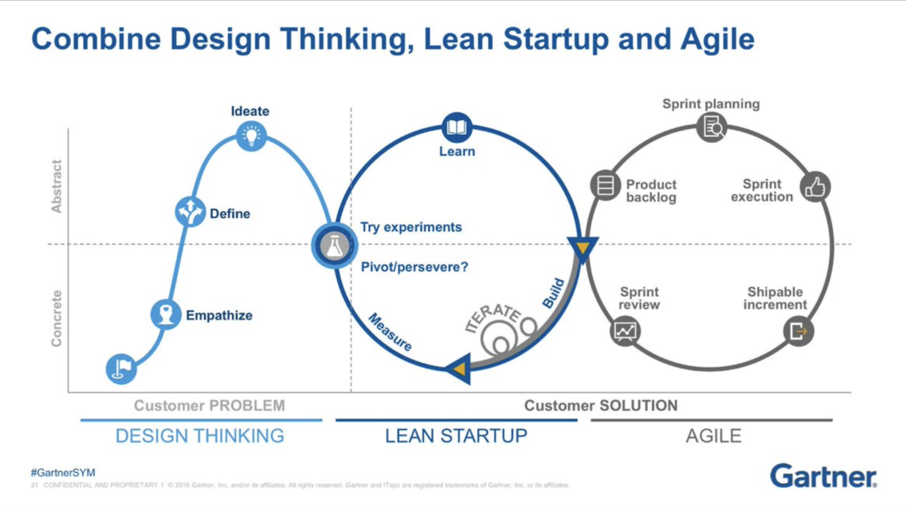
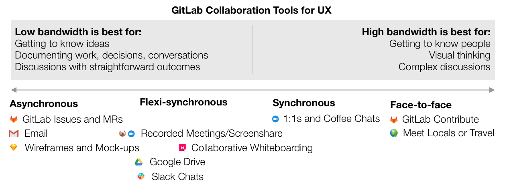

## On this page
{:.no_toc .hidden-md .hidden-lg}

- TOC
{:toc .hidden-md .hidden-lg}

用户体验部与社区、产品经理（PMs）、前端工程师（FE）和后端工程师（BE）一起工作。产品经理负责启动计划和设定产品方向。产品经理通过收集客户和用户的反馈来定义与功能相关的问题 "是什么 "和 "为什么"，他们给GitLab团队成员和更广泛的社区以建议和创造的空间。

用户体验应该在流程的早期协助推动[产品愿景](/direction/)。我们通过进行[生成性研究](/handbook/engineering/ux/ux-research/)和促进与社区成员、客户、产品经理、前端和后端的讨论来告知这个愿景。在创建工作时，我们超越了事务性工作流和生成性工作流，而不仅仅是执行任务。

## 用户体验工作流程

* [用户体验部门](/handbook/engineering/ux/ux-department-workflow/)
* [产品设计师的工作流程](/handbook/engineering/ux/ux-designer/)
* [用户体验研究员的工作流程](/handbook/engineering/ux/ux-research/)
* [技术写作的工作流程](/handbook/engineering/ux/technical-writing/workflow/)

## 用户体验团队的使命

我们的使命是与更广泛的GitLab社区和其他GitLab团队成员合作，迅速创造出客户认为比竞争对手的产品和工具链更有价值的产品和体验。为了实现我们的使命，我们承诺要做到以下几点

* **创新** - 我们通过GitLab统一的、功能完整的解决方案，用精简的解决方案和无缝的体验取代互不相干的工具链，创造[颠覆性创新](https://www.economist.com/the-economist-explains/2015/01/25/what-disruptive-innovation-means)。
* **信息化** - 我们与产品管理部门合作，进行基于证据的规划、创新、设计和交付所需的快速研究和原型设计。
* **高效** - 我们通过传统的 "无聊 "解决方案、精益用户体验和设计重用（如我们的设计系统Pajamas），更快地产生更多价值。
* **结果导向** - 我们专注于快速、持续地交付客户成果（而不是设计和文件）。
* **协作** - 我们以开放的方式进行设计，并促进协作，因此GitLab团队成员和更广泛的GitLab社区可以自始至终改进策略和解决方案。

## 人人贡献

用户体验部门并不仅仅负责GitLab的用户体验。我们鼓励每个人都提出自己的想法，让GitLab变得更好。你可以只使用文字或者包含图片。这些图像可以采取多种形式;以下是一些例子:

* 用来表达你的想法的绘画或草图
* 使用你常用的软件（Balsamiq、Sketch等）制作线框图。
* 使用[Pajamas 设计系统][pajamas]制作的高保真图。
* 通过在浏览器中操作DOM，对我们的用户界面进行修改的截图

如果你正在创建高保真设计，请确保让其他人知道这是一个需要用户体验审查的提案。你可以向用户体验团队中的任何人寻求帮助。

## 主动和被动的用户体验

我们总是有责任完成那些有助于 "维持正常运转 "的被动任务，例如错误修复和小型用户体验改进。但我们也必须拿出一部分时间来做主动性的工作，找出现有的痛点，重新定义我们处理问题的方式，并发现可操作的创新和改进机会。这种主动的用户体验工作使我们能够创造出最完整、最有竞争力和最有弹性的解决方案。

要为主动的用户体验工作找到空间并不容易，但这种挑战是值得的，因为这是我们创造一流产品体验的方式。而且这不仅仅是UX团队的责任；它也需要领导层、产品和工程部门的协调努力。

我们目前正在努力寻找主动和被动的用户体验工作之间的正确平衡。虽然我们没有一个规定的比例，但我们也不会将100%的可用工作时间分配给被动工作。在每个里程碑开始前和开始时，用户体验人员应该与他们的经理合作，根据我们积极的OKRs和阶段组的要求，定义适当的比例。当有关于优先级或范围的问题时，或者当用户体验人员担心在最后期限前完成工作时，他们应该立即联系他们的经理，帮助他们解决任何问题。尽早沟通，经常沟通!

### 主动式用户体验的例子

积极主动的用户体验工作的一个例子是我们的[用户体验计分卡](/handbook/engineering/ux/ux-scorecards/)计划。另一个例子是我们的用户体验研究人员领导的生成性研究（同时邀请跨职能的合作伙伴参与）。还有一个例子是正在进行的美化我们的用户界面的努力，包括通过[小的、战术性的改变](https://gitlab.com/groups/gitlab-org/-/epics/989)以及通过我们的[Pajamas设计系统][pajamas]。

**用户体验记分卡**  
设计师使用[用户体验计分卡](/handbook/engineering/ux/ux-scorecards/)来衡量常见的用户任务。在许多情况下，任务涉及到产品的多个阶段，使设计师能够看到用户是如何穿越各个阶段的。设计师可以通过[体验建议](/handbook/engineering/ux/ux-scorecards/)了解如何在即将到来的里程碑中改善体验。

## 迭代

在GitLab，迭代意味着做出[能增加价值的最小产出并尽快推出](/handbook/values/#iteration)。这样的工作方式使我们能够缩短周期，更快地获得用户的反馈，从而能够继续快速有效地改进。

迭代不仅仅是GitLab的六个创始价值之一，[C.R.E.D.I.T](/handbook/values/#credit)，它还是[设计思维和用户体验的基础概念](https://www.interaction-design.org/literature/article/design-iteration-brings-powerful-results-so-do-it-again-designer)之一。在没有真实世界的反馈的情况下，太过提前的计划会导致你建造出不符合用户需求的东西。

迭代在一个开源社区中尤其重要。保持小规模和迭代的变化使任何人都能轻松做出贡献。以下是一些例子，说明我们如何拥抱迭代的力量，并利用它来建立GitLab。

* 我们积极地将问题分解成尽可能小的范围。如果一项工作太大，无法在一个里程碑中完成，那么它就是太大。[Epics](/handbook/product/product-processes/#epics)使我们能够保持对一个领域的整体看法，同时将工作分解成一个MVC。
* 我们保留了一个积极寻求社区贡献的改进议题列表。它们的范围很小，允许社区为这些议题贡献设计或代码。你可以在本手册的[社区贡献](/handbook/engineering/ux/ux-department-workflow/#community-contributions)部分了解更多信息。你也可以[查看需要用户体验工作的议题列表](https://gitlab.com/groups/gitlab-org/-/issues?state=opened&label_name[]=Accepting+merge+requests&label_name[]=UX)。
* 你可能注意到，我们的[设计系统](https://gitlab.com/gitlab-org/gitlab-services/design.gitlab.com)有很多 "待办 "事项。我们没有试图一下子解决所有问题，而是逐步充实我们的组件库，并逐步将这些组件推广到生产中。

## 结对设计

结对设计给了产品设计师一个稳定的伙伴，在工作开始时与之一起构思，在设计过程中得到反馈，并进行[设计审查]（/handbook/engineering/ux/ux-designer/#design-reviews）。这也让产品设计师接触到他们自己以外的产品领域。

* 每六个月都有新的设计师对接。 
* 结对任务应该由不同阶段的设计者组成（例如，一个负责计划阶段组的设计师应该与计划阶段组以外的人结对）。
* 如果我们有奇数的设计师，我们将有一个3人的伙伴关系。
* 两人决定分享什么和何时分享；这里没有预先规定的时间表或准则。
* 当务之急是征求反馈意见并提供背景。

[Design Pair Rotation](./design-pair-rotation/)

## 稳定的对接方

每个产品设计师都与项目经理保持一致，并对他们的项目经理监督的相同功能负责。
技术撰稿人各自支持多个阶段的小组。用户体验研究人员支持一个部门内的多个PM。

用户体验人员在流程的每个阶段与项目管理人员和工程人员一起工作：计划、探索、实施和进一步的迭代。产品设计师或技术撰稿人所负责的领域是他们头衔的一部分；例如，"产品设计师，计划阶段组"。你可以在[团队组织结构图](/company/team/org-chart/)中看到每个产品设计师或技术撰稿人与产品的哪个领域保持一致。

### 人员规划

本着 "稳定同事对接"的精神，我们对HC的规划如下。

* **每个阶段组都有一个产品设计师**
    * 产品设计师与产品经理的比例为1:1(不包括对UI没有影响的阶段组，或者在某些情况下，使用率较低的阶段组)
    * 1名产品设计师：1-3名前端工程师；2名产品设计师：4-5名前端工程师
* **为最多三个阶段小组配备一名技术写作人员**
    * 技术撰稿人与阶段组的比例为1：3
    * 技术作家与工程师的比例约为1：21
* **一名用户体验研究员负责最多5个阶段的小组工作**
    * 用户体验研究员与产品经理的比例为1：5
    * 用户体验研究人员和工程师的比例大约为1:35
* **与职能相适应的经理人支持比例**
    * 在用户体验研究和产品设计方面，经理和直接报告人的比例大约为1：5
    * 在技术写作方面，管理人员与直接报告人的比例约为1：7

### 带薪休假

[带薪休假](/handbook/paid-time-off/)很重要。同样重要的是，希望回到工作中时感到精神焕发。我们不鼓励团队成员在休假期间检查与工作相关的活动，这样当他们回来时就不会感到太紧张。为了防止这种情况的发生，你的阶段组设计同行或经理(如果你没有阶段组设计同行)将在你的PTO(带薪休假)期间作为你的后援:

* 为产品和工程部提供一个接触点，以询问与你的阶段组有关的用户体验问题。
* 在可能的情况下，解除议题或合并请求的阻塞。
* 将工作委托给团队中的其他人。
* 如果在他们离开时无法解决或委托他人解决，则在他们回来时与报告沟通阻塞议题或合并请求。

当设计师不在的时候，后备人员负责处理关键的UX工作。关键的UX工作被定义为任何解决中断、没有解决方案的坏特性，或者当前解决方案是不被接受的工作。如果一个后备人员开始感到工作量过重，他们应该立即向他们的经理寻求帮助。必要时，你的经理会帮助你进一步分配任务。

请假时，一定要[与其他人沟通](/handbook/paid-time-off/#communicating-your-time-off)。

* 在 [PTO by Roots](/handbook/paid-time-off/#pto-by-roots), 为你在带薪休假期间的后备人员设置一个角色，并将UX日历添加到你的设置中（其日历ID在谷歌日历设置中），这样你的带薪休假事件对部门中的所有人都是可见的。
* 在GitLab设计项目中，使用[用户体验覆盖模板](https://gitlab.com/gitlab-org/gitlab-design/-/blob/master/.gitlab/issue_templates/UX%20Coverage.md)打开一个新议题，并列出在你处于带薪休假期间负责的后备人员需要覆盖的优先级和议题。
  * 确保在预定的带薪休假之前至少提前一周打开你的用户体验覆盖问题，以有效地评估开放任务的范围，并与你的后备人员在覆盖项目上保持一致。
  * 确保与你的产品和研发经理保持一致，在你的带薪休假期间不会安排新的功能设计工作。后备人员只负责处理紧急需求，例如审查里程碑期间正在开发的MR，对已经建立了设计方案的一般议题提供反馈，以及回复Slack问题等。
  * 在准备好带薪休假前，确保重要的设计讨论是关闭的。通过这种方式，备份人员可以避免花费大量时间寻找SSOT(Single source of truth)，并围绕请求收集历史数据，因为这将导致阻塞团队。

当休长假时，例如[育儿假](/handbook/total-rewards/benefits/general-and-entity-benefits/#parental-leave)，与你的经理合作，与相关稳定的同行沟通，确保减少该阶段的UX工作量，以避免团队中的其他设计师产生倦怠。

重返工作岗位时，您无需负责响应您离开时累积的每一个待办事项。利用[PTO Tanuki](https://gitlab.com/yorickpeterse/pto-tanuki)这样的工具有助于在返回时减少过时的提及。

### UX过渡

当单个阶段、小组或类别的责任发生变化时，我们使用[UX过渡](https://gitlab.com/gitlab-org/gitlab-design/-/issues/new?issuable_template=UX%20Transition) 议题模板来提供UX部门团队成员之间稳定和一致的交接。 

## 协作模式

我们相信，产品、用户体验和工程之间强有力的跨职能协作将带来最成功的产品。

这些角色应该得到很好的平衡，这样每个小组都可以为产品做出贡献，并就构建什么以及如何构建做出明智的决定。协作使我们能够构建所需的、可用的和可行的特性。它还帮助GitLab实现业务目标，让用户满意，并建立高质量、快速和安全的软件。

伟大的协作有三个基本部分:共享过程、适当的工具和心理安全。

### 协作要点1：共享过程
关于我们如何工作的共享过程 (团队中的每个人都理解)对于协作是必不可少的。如果我们不明白我们是如何工作的，那么我们就不能很好地合作。与产品、用户体验和工程合作编写的手册部分正在开发中， 将作为我们[双轨敏捷](https://www.mindtheproduct.com/2017/04/dual-track-agile-messy-leads-innovation/) 过程的唯一可信来源。 现在，请确保您熟悉[产品](/handbook/product/) 和 [工程](/handbook/engineering/) 团队以及他们的工作方式。

#### 双轨制敏捷
我们遵循一种[双轨制](/handbook/product-development-flow/)开发方法，帮助我们更聪明、更快速、更协作地工作。在这种模式下，一个工作轨道专注于*验证*为我们的产品增加价值的东西，另一个工作轨道专注于*建造*已经被验证的东西。这两个轨道在每个里程碑期间都是同时进行的。

用户体验研究和设计是这两方面的重要组成部分。与客户或潜在客户交谈，了解他们的问题是这个想法的核心。

在GitLab，随着时间的推移，我们正在采用这个模型的概念。目前，我们在构建轨道上做得很好，但我们想把更多的注意力转移到验证轨道上(我们也将其称为[被动用户体验vs.主动用户体验](#proactive-and-reactive-ux)).

如果你有兴趣学习更多关于双轨敏捷和其他生产优秀产品的方法，你可以看看Marty Cagan的书[Inspired](https://www.goodreads.com/book/show/35249663-inspired) 。 如果你不想读完整本书，你可以试试阅读[摘要](https://www.becausetech.rocks/blog/inspired/)
或者这个 [有声书](https://www.blinkist.com/en/books/inspired-en).

### 协作要点2：协作工具
我们在GitLab有很多协作工具。我们有责任根据情况选择最佳的沟通媒介，并了解何时以及如何使用我们的工具。另一家远程公司Zapier写了一篇[关于协作工具和方法的文章](https://zapier.com/blog/remote-design-culture/)，帮助促进远程团队之间的沟通。 

### 协作要点3：心理安全和信任
人们在这样的环境中茁壮成长，他们可以把自己独特的观点带到工作中，毫无顾虑地提出想法，并以健康和富有成效的方式公开辩论和批评观点。阅读更多关于[团队信任](https://www.inc.com/justin-bariso/google-spent-years-studying-effective-teams-this-single-quality-contributed-most-to-their-success.html)以及为什么它很重要。

### 何时合作
我们远程和异步的工作方式可能使我们很难知道什么时候需要协作。这里有一些需要考虑的事情。

- 记住同步和异步通信的优缺点。两者都有合适的时机，对你正在做的工作来说，使用合适的时机是成为领导者和为团队合作树立良好榜样的重要方式。
- 增加合作永远不会有坏处，所以如果有疑问，就联系你团队中的某个人，和他们聊聊某个想法、某个用户问题或你的设计工作。
- 让你的产品经理知道你希望被纳入规划对话中。如果你能尽早知道PM在考虑做什么，你就可以让研究团队尽早参与到这个过程中。
- 产品设计师将在所有的工作轨道（问题验证、解决方案验证和构建）中与PM合作处理问题。然而，当问题是在产品设计师的职责范围内进行设计或测试解决方案所需的用户体验工作时，应该直接分配给产品设计师。这通常意味着问题验证已经完成，用户故事/需求已经被很好的定义，足以让设计师在解决方案上取得进展。产品设计师也负责通过UX工作流程来处理问题，并在工作准备好进入Build轨道时分配一个 `UX ready` 标签。就在UX Ready之前，是PM、UX和工程部最后一次同步的好时机，以确保问题确实已经准备好进行开发。在[GitLab文档](https://docs.gitlab.com/ee/development/contributing/issue_workflow.html)中了解更多关于我们如何使用工作流标签的信息。
- 以适合你所从事的项目类型的方式进行协作。例如:
	- **一个全新的特性**需要高水平的协作，包括同步头脑风暴、草图和辩论。用户研究团队应该参与进来。特性越大或风险越大，您应该向PM提出的问题就越多。
	- **当对现有体验做出重大改进时**，与更多人(包括客户、产品、工程和支持人员)进行交谈是很重要的，目的是收集完整的背景信息，并了解你的改变将产生的影响。
	- **在添加功能深度时**，在用户研究期间与整个团队合作，仔细决定哪些功能最有价值。另外，让您的跨职能团队决定如何添加功能，以保持产品的其他部分对客户可用和有用。

史诗的开始是一个与产品经理和团队其他成员尽可能多地讨论整个大局的好时机。像旅行地图、屏幕或用户流这样的视觉效果可以帮助每个人保持在同一个页面上，并使这些讨论更加丰富。

记住:

- **问大的问题**。当UX设计师理解他们工作的特性背后的原因时，他们的设计是最好的。问问你的PM为什么这个特性有价值，为什么它比其他东西更重要，他们想要实现什么目标，等等。
- * *寻求帮助。**当你正致力于一些特别模糊或棘手的内容时，或者你正努力在多个选项中做出选择时，这便是你需要合作的信号。邀请用户体验研究，PM和/或工程来讨论。
- **经常与产品经理和工程师一起审查设计想法，在他们最终确定*之前*。**如果你的跨职能伙伴第一次看到一款包含高保真资产或规格的设计，*那就太晚了*。
- **让你的团队参与研究。**可用性测试是另一个合作的好时机。邀请团队成员观看会议并参加研究综述。
- **邀请同行参与你的流程。**一些用户体验和项目管理的任务是重叠的，个人技能也有很大的不同。保持沟通，并谈论谁在做什么。有些项目管理人员喜欢做一些设计工作，有些用户体验人员喜欢产品策略。这总是一件好事。有了良好的沟通，你们可以在不冒犯对方的情况下发挥各自的优势。
- **提倡优秀的UX。**考虑要求你的PM在每个sprint中分配时间给“客户满意”相关的故事。这可以是一个百分比，一个点数，或者任何其他可行的方法。这是一种保持专注于客户体验和乐趣的方法，即使其他优先事项开始挤入。

[pajamas]: https://design.gitlab.com/
