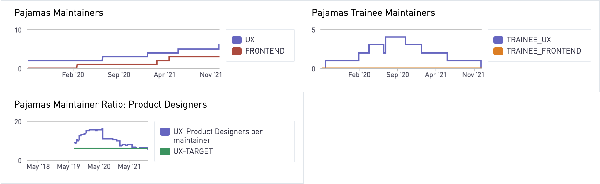

## 概述

Pajamas 设计系统由各种项目组成，其中设计审查是强制性的。

1. [`design.gitlab.com`](https://gitlab.com/gitlab-org/gitlab-services/design.gitlab.com)
1. [`gitlab-svgs`](https://gitlab.com/gitlab-org/gitlab-svgs)
1. [`gitlab-ui`](https://gitlab.com/gitlab-org/gitlab-ui)

本页描述了[审查者](#reviewer)和[维护者](#maintainer)在批准和合并你（or a community member's）的合并请求（MR）中的作用。它还描述了[成为维护者](##how-to-become-a-maintainer)的过程。

## 审查者

所有 GitLab 产品设计师都可以（并且被鼓励）对影响 Pajamas 的 MR 进行设计和代码审查。这包括来自 [GitLab 团队成员](https://about.gitlab.com/handbook/communication/top-misused-terms/)和更广泛的 GitLab 社区的贡献。如果你想审查 MR，你可以等到有人分配给你一个，但也非常欢迎你浏览开放的 MR 列表，并留下你可能有的任何反馈或问题。

为了进行审查，你应该熟悉并遵守:

- 我们的通用[代码审查指南][code-review-guidelines].
- 我们的通用[产品设计师的 MR 审查指南](https://about.gitlab.com/handbook/engineering/ux/product-designer/mr-reviews/).
- [Pajamas 项目](#overview)的贡献指南.

请注意，虽然所有设计者都可以审查所有的 MR，但接受 MR 的能力只限于维护者。你可以在[GitLab 工程项目][eng-projects]的列表中找到所有设计审核者和维护者。

## 维护者

维护者是GitLab的设计师，他们:

- 是设计和 [代码审查][code-review-guidelines] 方面的专家，包括审查提交信息。
- Know the GitLab product, design guidelines, and code base very well.
- 被授权在一个或几个[Pajamas 项目](#overview)中接受MRs。

每个项目至少有一个维护者，但大多数项目有多个，有些项目（如`gitlab-ui`和`design.gitlab.com`）有单独的设计和前端维护者。与审核员一样，设计维护者可以在[GitLab 研发项目][eng-projects]列表中找到。

在[工程评审工作流](https://about.gitlab.com/handbook/engineering/workflow/code-review/#maintainer)中阅读更多关于什么是优秀的维护者的信息。

### 维护者类型

设计维护者分为不同类型的维护者。这有助于维护人员专门化，但更重要的是，它有助于加快成为维护人员的过程，并且知道谁应该请求最终接受 MRs.。可以创建新类型或重构现有类型，以适应项目的自然发展。

| 项目 | 维护者类型 |
|---|---|
| `design.gitlab.com` |  `Figma` (Pajamas UI Kit): 审查文件组织、对象属性、交互设计、可及性、视觉设计和技术可行性。 `UX` (Pajamas website): 审查内容含义、术语和网站所有部分的结构。 |
| `gitlab-svgs` | `Figma` (Pajamas UI Kit): 检查图标和插图文件组织，对象属性和视觉设计。 |

如果你有兴趣成为 `gitlab` 或 `gitlab- UI` 项目的 UI (`.scss`)维护者，请遵循[工程评审工作流](https://about.gitlab.com/handbook/engineering/workflow/code-review/)。

### 如何成为一名维护者

我们与工程部的同行遵循同样的维护者准则。熟悉这些准则以及如何在[工程审查工作流程][eng-become-maintainer]中成为一名维护者。

这一过程的三个关键方面:

1. **"维护者级别 "的 MR**。候选人应该有近期 "维护者级别 "的 MR 的具体例子。他们可以从事任何类型的 MR，但 "维护者级别 "的MR是维护者职位的重点。"维护者级别 "的MR在[工程审查工作流程][eng-become-maintainer]中描述。
1. **评论或贡献**。贡献的 MR 也算在内。无论 MR 是由候选人审阅还是贡献，它们都应该始终如一地通过审阅者和/或维护者的审阅，而不需要做重大的修改。
1. **实习岗位可选**:[实习维护人员计划](#trainee-maintainer)(实习岗位)支持审核人员成为维护人员，但该计划不是必需的。最近参与了相当数量的“维护者级” MR 的设计师可以不用培训就成为维护者。任何人都可以提名自己(或其他人)担任维护人员，遵循[工程评审工作流][eng-become-maintainer]中描述的过程。

#### 见习维护者

**我们目前没有能力支持更多的受训者。只有当我们有一个[支持维护者](https://about.gitlab.com/handbook/engineering/projects/#design.gitlab.com)可用，并且需要额外的维护者时，我们才能容纳实习生。如果你有兴趣成为维护者，我们鼓励你和你的经理谈谈!**

**注:虽然维护人员负责某些项目，但成为一名维护人员并不是职业发展的必要条件，这也不应该是成为实习生的主要原因**

- 我们遵循与工程部同行相同的见习维护者计划（见习）。任何人都可以通过使用[见习设计维护者模板](https://gitlab.com/gitlab-com/www-gitlab-com/issues/new?issuable_template=trainee-design-maintainer)打开一个跟踪议题来提名自己为受训者。

- 对于见习期，每个见习生都会有一个设计维护者被指派为支持维护者。支持维护者将指导 MR 进行审查，对提案进行反馈，并在1:1会议上讨论过程或进展。受训者可以随时向他们的经理或其他维护者寻求反馈和指导，与专门的支持维护者分开。我们还创建了一个[Pajamas UX 维护者 审核清单](https://gitlab.com/gitlab-org/gitlab-services/design.gitlab.com/-/blob/main/doc/maintainer-checklist.md)，以帮助指导受训维护者学习审查 Pajamas MR。

- 我们尽量保持每个维护者最多只能有一个实习生，这样维护者就不会因为作为支持维护者的额外角色而负担过重，并能提供足够的指导。请参阅我们的[当前的实习维护者](#current-trainee-maintainers)。

##### 持续时间

见习是一个长期的承诺，通常是几个月，需要占用其他职责的时间。如果你有兴趣报名参加这个项目，请在提名前与你的经理和团队讨论，因为见习期很可能会影响你的能力。

有两个方面对见习期有很大影响：专门用于见习的时间和可供见习的 MR 数量。当这两个方面相互抵触时，见习期可能比预期的要长。

1. **时长多, MR 少**：为了增加MR的数量，受训者可以随时做出自己的贡献。审核别人的 MR 并不是成为维护者的唯一途径。受训者必须具有创造性，并尽可能地在 "维护者级别 " 的MR上工作。
1. **时长少，MR 多**：试图在几个小时内审查或贡献许多 MR，会对质量产生负面影响。受训者应该专注于质量，因为这是被评估的内容。他们还应该遵循我们的[第一反应服务水平目标（SLO）](https://about.gitlab.com/handbook/engineering/workflow/code-review/#first-response-slo)。如果受训者想加快受训速度，他们应该与他们的经理商量，找到平衡工作量的方法，为这个项目腾出更多时间。

To help track progress, we encourage trainees to make the traineeship one of their personal OKRs.

### Maintainer ratios

See the [Pajamas maintainer ratio dashboard](https://app.periscopedata.com/app/gitlab/658466/Pajamas-Design-System).

##### 目前的见习维护者

| 项目 | 受训人员 | 支持维护者 |
| ------- | ------- | ------------------ |
| Pajamas 设计系统 (Figma) | [Nadia Sotnikova](https://gitlab.com/nadia_sotnikova) | [Jeremy Elder](https://gitlab.com/jeldergl) |
| Pajamas 设计系统 (Figma) | [Michael Le](https://gitlab.com/mle) | [Jeremy Elder](https://gitlab.com/jeldergl) |
| Pajamas 设计系统 (Figma) | [Libor Vanc](https://gitlab.com/lvanc) | [Jeremy Elder](https://gitlab.com/jeldergl) |
| Pajamas 设计系统 (Figma) | [Camellia Yang](https://gitlab.com/cam.x) | [Jeremy Elder](https://gitlab.com/jeldergl) |

[code-review-guidelines]: https://docs.gitlab.com/ee/development/code_review.html
[eng-become-maintainer]: /handbook/engineering/workflow/code-review/#how-to-become-a-project-maintainer
[eng-projects]: /handbook/engineering/projects/
