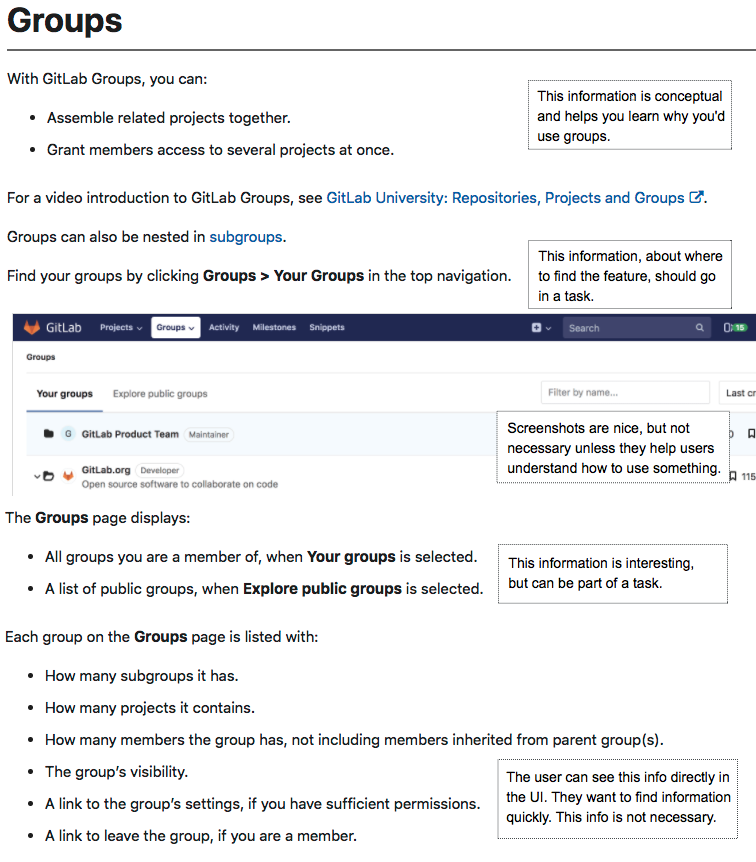
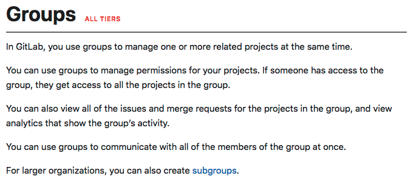
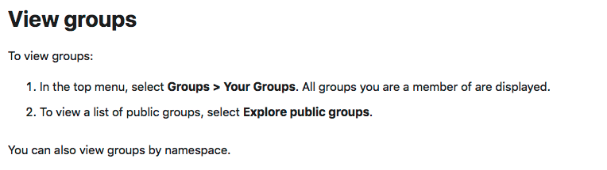
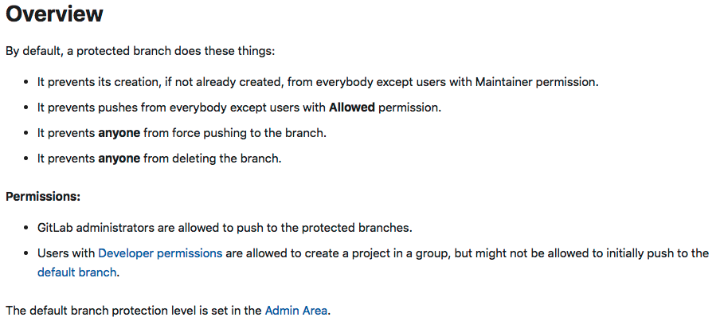
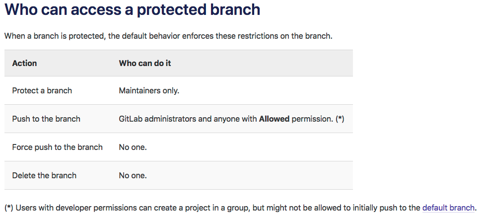

## On this page
{:.no_toc .hidden-md .hidden-lg}

- TOC
{:toc .hidden-md .hidden-lg}

We often write pages of documentation that contain disparate kinds of information.
We want to make sure we're telling readers everything they need to know.

However, research shows that information is easier to digest if it's presented in
repeatable patterns, so at GitLab we're moving toward using industry-standard
[topic types](https://docs.gitlab.com/ee/development/documentation/structure.html).

Each topic, or section on a page under a heading, should be identifiable as a concept, task, reference, or
troubleshooting topic. This structure helps our users recognize patterns and
makes both searching and scanning more efficient.

The following examples are intended to help you understand how to take
existing information and edit it into topics of specific types.

## Concept and task topics: Before

The following topic was trying to be all things to all people. It provided information about groups
and where to find them. It reiterated what was visible in the UI.

## Concept and task topics: After

The information is easier to scan if you move it into concepts and tasks.

### Concept

### Task

## Reference topic: Before

This topic was a compilation of a variety of information and was difficult to scan.

## Reference topic: After

The information in the **Overview** topic is now organized in a table
that's easy to scan. It also has a more searchable title.

