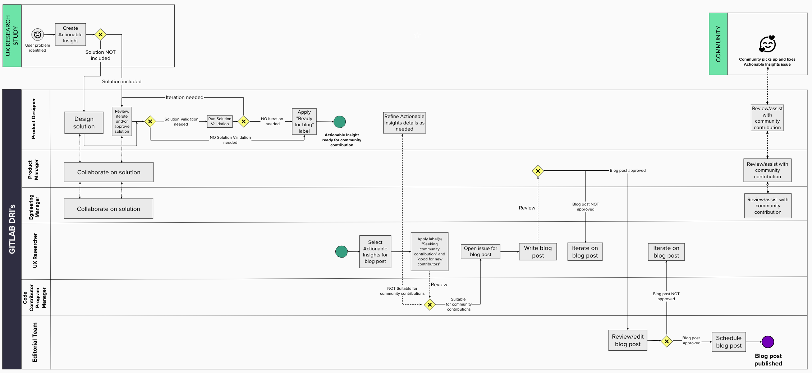

用户研究的最大价值之一就是对收集到的洞察付诸行动并最终实现。作为用户体验研究可交付成果的一部分就是，创建 [Actionable Insight issues](/gitlab-com/www-gitlab-com/master/handbook/product/ux/ux-research/research-insights#actionable-insights)，允许产品团队关注并修复用户体验研究发现的问题。

GitLab 的伟大之处在于每个人都可以做出贡献，而不仅仅是我们内部的产品团队。让更多的 GitLab 社区参与进来并寻求他们的支持，可能有助于更快地解决 “Actionable Insight“ 问题，从而改善 GitLab 的使用体验。撰写文章是帮助展示这些洞察力的一种方式。

下面的过程描述了用户体验研究人员如何创建博文，呼吁社区贡献力量，实施解决用户体验研究中发现的用户问题的方案。

## 谁参与其中，他们的职责是什么？

虽然用户体验研究人员是创建这篇文章的主要负责人(DRI)，但需要以下团队成员的合作:
- 产品设计师
- 产品经理
- 研发经理
- 编辑团队
- 贡献成功团队

**职责**

下面的表格概述了一些主要职责。

| 角色 | 职责 |
| ------ | ------ |
| 产品经理 | - 设计或审查并批准解决方案，以解决可行性洞察议题中概述的用户问题(与产品经理和研发经理合作)     - 根据需求进行解决方案验证     - 应用 "Ready for Blog" 标签 |
| 用户研究员 | - 攥写博客文章并附上可行性洞察的链接     - 应用 “Seeking community contribution” 和 “quick win” 标签    - 创建[博客文章提案议题](https://gitlab.com/gitlab-com/www-gitlab-com/-/issues/new?issuable_template=blog-post) |
| 产品经理 | - 与产品设计师合作解决用户问题     - 审查并批准博客文章 |
| 研发经理 | - 与产品设计师合作解决用户问题 |
| 代码贡献PM | - 审查选定的可行性洞察，并确保它们适用于社区贡献     - 审查博文的语言是否恰当，社区贡献的重点是否突出 |
| 编辑团队 | - 审查、最后编辑和批准博客文章     - 安排和发布博客文章 |

### 博客创建的工作流程是怎样的？

查看 [Mural](https://app.mural.co/invitation/mural/gitlab2474/1659097338577?sender=u5784f7c9d931cd5b88a66817&key=e69fdb2e-3216-4255-9f79-1b20bddcda82) 中的工作流程.

### 我应该在我的博客文章中包含什么内容?

建议在博客文章中包含以下信息:

- 研究主题(我们做了什么)
- 洞察力(我们学到了什么)
- 解决方案(我们想要改变什么，为什么)
- 链接到可行性洞察的议题，供社区贡献者选择

为了激励贡献者并帮助他们取得成功，可能需要包含社区最近完成的可行性洞察的链接，或关于如何为[GitLab做出贡献](https://about.gitlab.com/community/contribute/)的有效链接。 

想要获取灵感,你可以看看[第一个发布的博客文章](https://about.gitlab.com/blog/2022/07/25/5-problems-you-can-help-us-solve-right-now/)和对应的[博客文章提案](https://gitlab.com/gitlab-com/www-gitlab-com/-/issues/13599)。