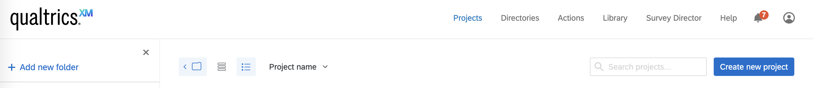
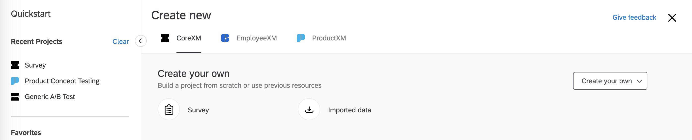
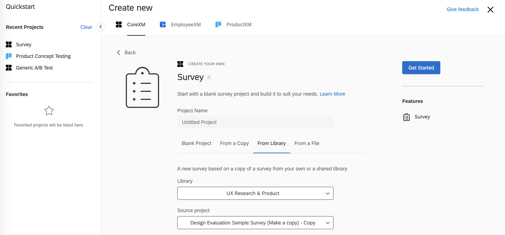
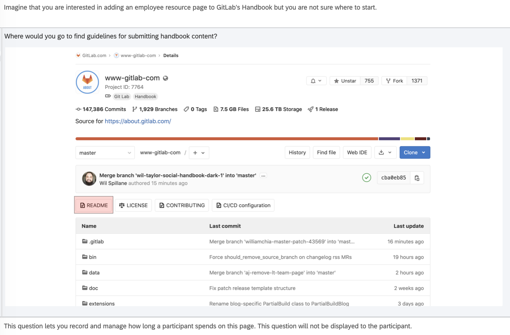
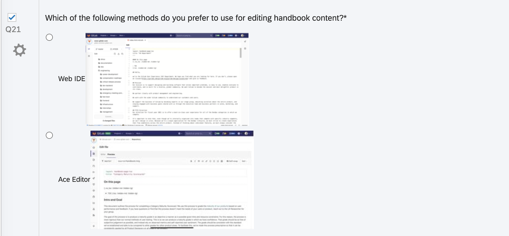

There are often situations when teams have more than one potential solution that meets user needs and is technically feasible. The question then becomes how to move forward when both designs could solve the problem. The goal of a design evaluation is to determine which solution users will prefer.

There are two methods we leverage at GitLab to evaluate designs. Each are done via Qualtrics ([request Qualtrics access - internal link](/handbook/business-technology/team-member-enablement/onboarding-access-requests/access-requests/)): 
* [first-click testing](/handbook/engineering/ux/ux-research-training/creating-design-evaluations/#first-click-tests)
* [preference testing](/handbook/engineering/ux/ux-research-training/creating-design-evaluations/#preference-tests)

## How to plan a design evaluation study 
When evaluating designs, it’s best to start by [creating a hypothesis](/handbook/engineering/ux/ux-research-training/defining-goals-objectives-and-hypotheses/) about an aspect of the design. 

Consider the following questions as you determine your goals and objectives for the study: 
* Where are you most and least confident? 
* What will happen as a result of including certain elements in one design versus other variations?
* What will determine whether this design is successful?

After determining what you need to test, you then need to identify ways to measure the success of the design. That’s where design evaluation studies come in.

Usability metrics help you answer questions about the usability of your design. Whether you have questions about findability or readability or you just want to know the preferred option, usability metrics can outline a clear goal for your study and improve your analysis.

Common usability metrics include:
* success rate
* time on task
* error rate
* satisfaction
* confidence

NNGroup has a [great article](https://www.nngroup.com/articles/usability-metrics/) that can provide more insight into usability metrics.

## First-click tests
First-click testing examines what a participant would click first in the interface to complete their intended task. It can be performed on a functioning website, a prototype, or a wireframe. It allows you to evaluate the effectiveness of the linking structure of your site/product, including the navigation, to see if users know how to get around and complete their intended task.

### Tips for creating a first-click test
* When creating tasks, focus on providing the participants with a problem to solve -- for example, “You are interested in finding out how much…how many…where to…” to foster a more natural interaction.
* Instruct the participant to stay silent during this portion of the session. Since we are capturing time on task, any speaking by the participant can throw this metric off.
* Make sure you know and have documented the correct path to complete each task, both for yourself and for your observers.  This will simplify note taking.
* Track each click.
* Time how long it takes the user to make this click. You can use the [Timing Question](https://www.qualtrics.com/support/survey-platform/survey-module/editing-questions/question-types-guide/advanced/timing/) in Qualtrics to do this.  Taking a long time to make that first click may indicate an issue with navigation that will need to be monitored or addressed.
* After each task, assess whether the participant feels they were able to find the correct information using a satisfaction or confidence scale.
* Next, assess the ease or difficulty of completing each task.  Using response scales here will aid analysis as well, but consider free-response options as well to provide additional context.
* Thoroughly pilot your test prior to launch, so you will have time to address any issues.
* It would be best not to tell the participant they are taking part in first-click testing.  

### How to use Qualtrics for first-click tests:
A combination of [Descriptive Text](https://www.qualtrics.com/support/survey-platform/survey-module/editing-questions/question-types-guide/static-content/descriptive-text-and-graphic/), [Heatmap](https://www.qualtrics.com/support/survey-platform/survey-module/editing-questions/question-types-guide/specialty-questions/heat-map/), and [Timing](https://www.qualtrics.com/support/survey-platform/survey-module/editing-questions/question-types-guide/advanced/timing/) question types are used to create task scenarios and record the respondent’s first click on the image.

**Step 1:** After logging into Qualtrics, click on Projects in the top navigation and click the Create new project button at the top right of the page.

*Note: If you plan to create your own survey from scratch, first you should select Create a new CoreXM and then Create your own survey.*

**Step 2:** Choose to create a blank project, or make a copy of the sample design evaluation survey in the UX Research & Product Library.

**Step 3:** Add your questions:
* Use a ***Descriptive Text*** question to set up the task scenario:
   * Create a new survey block
   * Create a New Question
   * From the Change Question Type dropdown, select ‘Descriptive Text’

* Use the following steps to set up a ***Heatmap*** question:
   1. Create a New Question
   2. From the Change Question Type dropdown, select ‘Heat Map’
   3. Click ‘Select a graphic to use for this question’
   4. Select a graphic you’ve already uploaded to your Qualtrics account (or upload a new one from your computer)
   5. Set the number of clicks each respondent may make on the image (‘1’ is the default)
      * ***Note: If the respondent clicks more than the allowed number of times, their oldest click will be replaced with the newest one.***
        * If you plan to analyze the data based on the user’s initial instinct (one click only), you should allow one click.
        * If you want to evaluate multiple correct locations or see the user’s first click and last click, you should allow more than one click.
   6. Click ‘Add Region’
      * Adding regions will help you calculate the percentage of users who clicked in the correct location more efficiently.
      * If you do not add regions for the correct locations, all the clicks will be grouped as "Other" in the data report from Qualtrics. 
      * Regions are not required for a Heat Map question, but they can make reporting easier. 
   7. Click and drag the region to move it, or click and drag the corners to resize it.
   8. Click the text box beneath the region to type a region name (make sure to use a descriptive name as this name will not display to respondents, but will be used in your survey results).

* Create another block in your survey, and add a Text Entry question to have the user explain their motivation for clicking in a certain area. Example: Why did you click there? (open text)
  * You can also use a [Multiple Choice](https://www.qualtrics.com/support/survey-platform/survey-module/editing-questions/question-types-guide/standard-content/multiple-choice/) question to have them rate their level of confidence.
    * Example: How confident are you that you clicked the correct location?
      * Completely confident
      * Somewhat confident
      * Neutral
      * Somewhat unsure
      * Completely unsure

## Preference tests 
Preference tests help you choose between design variations by asking users to select their preferred option. You can have the participant select a preference based on the appearance of the design, how well it communicates information, or other qualities that evaluate your hypothesis. The participant does not select their preference based on interacting with the design. If you want to gather data based on actions, conduct a Usability Test.

Preference testing can be used to evaluate a variety of static designs: icons, one page mockups, color palettes, design components, and more. It is important to note that you should not use this method to test workflows or anything that requires interaction.

### Tips for creating preference tests:
* Any visuals used must contain the full context for the design to be accurately assessed.
* Screenshots must be large enough to be clearly viewed and read easily.
* These tests are commonly used to measure aesthetic appeal, but participants can be instructed to judge designs based on their trustworthiness or how well they communicate a specific message or idea.

### How to use Qualtrics for preference tests:

**Step 1:** After logging into Qualtrics, click 'Projects' in the top navigation, and then click the 'Create new project' button at the top right of the page.

***Note: If you plan to create your own survey from scratch, first select 'Create a new CoreXM' and then 'Create your own survey.'***

**Step 2:** Choose to create a blank project or make a copy of the sample design evaluation survey in the UX Research & Product Library.

**Step 3:** Add your questions:
Use the ‘Single Answer, Vertical, Graphic’ type of Multiple Choice question to set up a preference test. 

* Follow that question with a [Text Entry](https://www.qualtrics.com/support/survey-platform/survey-module/editing-questions/question-types-guide/standard-content/text-entry/) question to understand why participants chose that option.
   * Example questions:
     * Why did you prefer that design?
     * Why did you pick that option?
     * Why did that option seem like the most [adjective] one?

