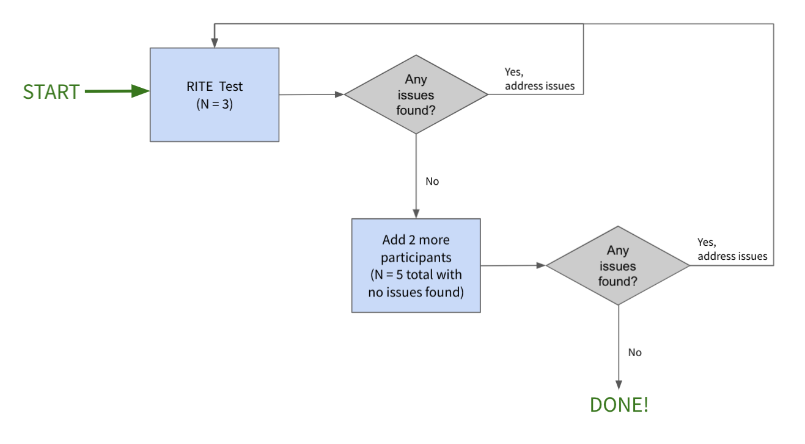

[Rapid Iterative Testing and Evaluation (RITE)](https://uploads-ssl.webflow.com/5d7142044df04fbb477795a2/5ef34f1709bc2ec95a6d3089_ef8a91900840263a4036b0433a389b7097b2.pdf) is a [usability testing method](/handbook/engineering/ux/ux-research-training/usability-testing/) where you evaluate a solution to a usability problem multiple times in a rapid and iterative manner. The goal is to identify not just usability problems, but also to react quickly on identified issues and test new solutions that cater to them. The end result of a RITE study is an experience (along with solutions to usability issues) that has been fully usability tested. This translates to an experience that we can be **highly confident** about shipping (in the context of usability), which helps to remove uncertainty around whether a proposed solution will be usable.

### How a RITE study works
Conducting a RITE study is quite simple and is similar to conducting a traditional usability test.  The differences are: 1) the sample size, and 2) immediately addressing issues as they are found.  The diagram below illustrates the workflow to follow when conducting a RITE study.

To summarize:
- **Step 1: Start with 3 participants**
     - If issues are found, address them, and repeat Step 1 with 3 new participants
     - If issues are NOT found, proceed to Step 2
- **Step 2: Add 2 more participants**
     - If issues are found, address them, and start at Step 1 again with 3 new participants
     - If issues are NOT found after testing 5 total participants, the study is done!

### Elements of RITE

In comparison to other usability testing protocols (here at GitLab and outside), RITE consists of the following elements:

- **It’s rapid and iterative:** RITE tests are run regularly with a smaller number of participants. Each usability problem identified you aim to fix _immediately_ and _test again_ with a new set of participants. This process continues until no new usability issues are identified. 

- **Classification of issues:** To move quickly with the test sessions, usability problems identified in a session are categorized into the following categories:

| Category | Description                                                                                                                                       | What to do                                                                               |
|----------|---------------------------------------------------------------------------------------------------------------------------------------------------|------------------------------------------------------------------------------------------|
|     A    | Issues with an obvious cause and an obvious solution that can be implemented in the prototype quickly, such as text changes, re-labeling buttons. | Implement solutions immediately and this will be the version for the next test session.  |
|     B    | Issues with an obvious cause and an obvious solution that can’t be implemented quickly/by the time of the next test session.                      | Start working on the solution to address these issues and test in an upcoming session.   |
|     C    | Issues with no obvious cause or due to other factors, such as task instructions.                                                                  | Collect more data in the upcoming session until they can be promoted to Category A or B. |

- **Domain knowledge and decision making:** The decision makers of the team should be present or catch up on the session insights in order to quickly react on the learnings from each session. Domain knowledge is essential to estimate if the observed problems are likely to be a problem for others.

### Roles and expectations to make RITE successful
RITE studies promise a rapid and iterative process for evaluating and improving design prototypes. It can only succeed if all contributors to the process are aware of their responsibilities and follow the schedule (timing and scheduling are critical to a successful RITE study). Make sure to inform yourself of your individual responsibilities and decide with your team what schedule best fits you. 

- **Product Designer:** Make time to prepare a design prototype, set up a test in usertesting.com based on the prototype, and then launch it. Watch the sessions as soon as they are available and analyze insights. Share your observations in the team sync and decide what changes need to be made with the Product Manager. Document all identified usability problems by placing them into the three categories (A-C). Based on the learnings, you need time to work on future iterations. In the example schedule below, we aim to test two iterations per week, which means during this week, the majority of your time will be spent on running RITE. 

- **Product Managers:** While optional, make time to watch each research session as soon as a study gets picked up. Share your observations in the team sync, and decide what changes need to be made with the Product Designer for the next iteration. In the example schedule below, we aim to test two iterations per week.

- **Engineering:** Building great products is a team effort, and having exposure to real users regularly is crucial. While optional, it’s recommended to make time to watch some or all of the sessions and contribute your insights in the team sync. 

### Sample size
The sample size for RITE studies is both unique and critical to follow. It's fairly simple: 
- N = 3 for each iteration and N = 5 to complete the process.

You only need 3 participants per iteration because as more iterations are made, the N increases, which provides that opportunity to capture additional usability issues. Over time, a larger number of users provides feedback on the product, and you fix the problems you identify as you go.

The RITE process is completed if you don’t identify any new usability issues in an iteration. However, a sample size of 5 participants is recommended to increase the likelihood of identifying the majority of usability issues. Therefore, if your iteration doesn’t bring in any new usability issues, add two more participants to ensure that all usability problems were identified. 

### Metrics

Since a RITE study is a usabity testing method, the same measures that are used for usability testing are used for RITE testing: Effectiveness, Eficiency, and Satisfaction.  The detailed measures to use can be found on the [usability testing](/handbook/engineering/ux/ux-research-training/usability-testing/#3-factors-to-measure) handbook page.

### Number of tasks

There's no magic number when it comes to how many tasks to include. A guideline is to have [3 - 4 tasks](/handbook/engineering/ux/ux-research-training/writing-usability-testing-script/#tasks) to ensure that participants don’t get tired and exhausted. Another aspect to consider is that unmoderated test sessions should be 15 - 20 minutes max and moderated sessions 60 minutes max. If you find your study may be too long for unmoderated testing, you might have to split your tasks across multiple usertesting.com sessions.

The key thing to remember when writing your tasks is [that they reflect realistic user goals](/handbook/engineering/ux/ux-research-training/writing-usability-testing-script/#tasks). Taking the JTBD into account when creating your tasks helps keep the focus on user goals.

### A sample RITE study approach

A RITE study can take place in as little as a single day, or up to as long as it takes.  The below example spans 5 days and is merely used to illustrate the process. If your team prefers a different pace, feel free to adjust the timeline accordingly. The example schedule is built to fit unmoderated usability testing using usertesting.com. If you prefer to run a moderated session, allow additional time for recruiting.

#### Day 1 - Preparation
Gather your team, and agree on a timeline on the following:

- When will the test session go live in usertesting.com?
- When will everyone watch the recordings?
- When will you input insights in Dovetail, and who will do it?
- How will you decide on the decisions and adjustments to make in the next iteration? For example, you might discuss async in Dovetail or use a sync meeting.

Prepare prototypes and the test script (this should be the same or similar to what you used for the baseline usability test).

#### Day 2  - Test Day
Run a pilot session, watch the recording, and adust your test plan as needed. 

Next, launch your test in usertesting.com to three participants.  Depending on how quickly the test comes back, analyze insights and organize identified usability problems using the [RITE classification](/handbook/engineering/ux/ux-research-training/rite/#elements-of-rite). Feel free to use a copy of [this Mural](https://app.mural.co/t/gitlab2474/m/gitlab2474/1613597941619/7b56a2a3ecbc2eb14889a7d0f66314b2a3517025). 

#### Day 3 - Sync with team
Everyone in the team should have a chance to watch the three sessions and become aware of the identified usability problems. Share your learnings and decide on the scope for the next session. Adjust and prepare your prototype accordingly. Remember that Category A issues should be fixed before the new test round.

#### Day 4 - Test Day
Same as Day 2: Launch your test in usertesting.com with three participants. Analyze insights and classify identified issues. 

#### Day 5 - Sync with team
Same as Day 3: Everyone in the team should have a chance to watch the session and contribute to deciding how to act upon the learnings. 

You can repeat this process in the same milestone or in an upcoming one, depending on how long it takes to find solutions for issues in Category B, as well as other activities that need to be taken care of. Document usability issues in Category B (Issues with an obvious solution that can’t be implemented immediately) in GitLab for future planning of work. 

The process is considered complete when usability issues are no longer found in a sample of 5 participants, and you're confident that your solution is user friendly, which may not happen within one milestone. 

---------------

### Frequently Asked Questions

**Can I conduct a RITE study in a single day?**
Yes, it's certainly possible.  With careful planning, you can use usertesting.com to complete a RITE study in a single day, whether it's moderated or unmoderated.  The key is careful planning and scheduling.

**Is it possible to make RITE testing my default usability testing method?**
As long as the requirements are being met, of course!  You will have more confidence around the usability performance of an experience tested through RITE than through a traditional usability study.  Why? Because you tested your solutions along the way - and you know those perform well!

**I don't have time to run a clean test with 5 participants.  What should I do?**
At that point, the test is no longer a RITE study and has the make up of a traditional usability study, where solutions that are addressed post-study are pushed out untested.  

