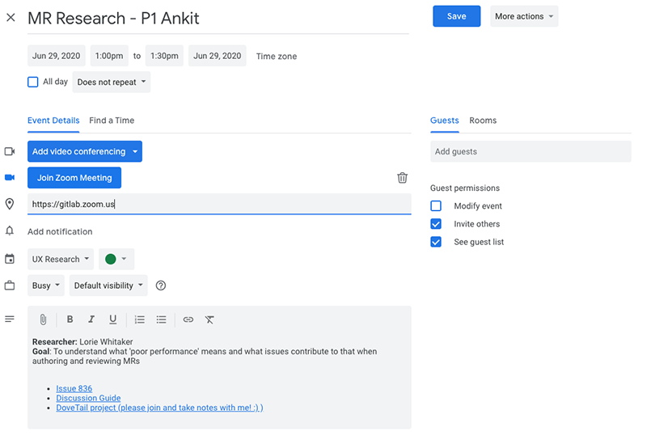

## On this page
{:.no_toc .hidden-md .hidden-lg}

- TOC
{:toc .hidden-md .hidden-lg}


## Research tools we use
Product Managers, Product Designers, and UX Researchers have access to the tools below.  If you need access to any of these tools, please [open an access request](/handbook/business-ops/team-member-enablement/onboarding-access-requests/access-requests/).
* [Qualtrics: CoreXM with TextiQ](https://www.qualtrics.com/uk/core-xm/) is used for surveys, screening surveys, and contacting members of GitLab First Look. It can also be used to conduct [First Click Testing and Preference Tests](/handbook/engineering/ux/ux-research-training/creating-design-evaluations/). For further information about Qualtrics, including how to create and style your survey, please visit [Qualtrics tips & tricks](/handbook/engineering/ux/qualtrics/).
* [Mural](https://mural.co/) is used for online brainstorming, synthesis, and collaboration.
* [Calendly](https://calendly.com/) is used for scheduling research sessions with users. A basic plan (free) is usually adequate for Product Managers and Product Designers. UX Researchers are entitled to a Premium account. Should you wish to upgrade your Calendly account to Premium, please contact @asmolinski2.
* [Dovetail](https://dovetailapp.com/) is used to analyze data, collaborate on insights, and as a research repository.
* [Zoom Pro Account](https://zoom.us/) is used to run usability testing sessions and user interviews. All new team members at GitLab automatically receive a Zoom Pro account.
* [Optimal Workshop](https://www.optimalworkshop.com/) is used to facilitate card sort testing and tree testing. We do not have an ongoing subscription, so a monthly license is purchased as needed. Contact @asmolinski2 if you need access.
* [UserTesting.com](https://about.gitlab.com/handbook/engineering/ux/ux-research-training/unmoderated-testing/) is used for certain unmoderated testing for [solution validation](https://about.gitlab.com/handbook/engineering/ux/ux-research-training/solution-validation-and-methods/) and [Category Maturity Scorecard studies](https://about.gitlab.com/handbook/engineering/ux/category-maturity-scorecards/).

## How to find existing research
* [Dovetail](https://dovetailapp.com/) is the single source of truth (SSOT) for all user insights discovered by GitLab Team Members.
* [UXR_Insights project](https://gitlab.com/gitlab-org/uxr_insights) - Prior to Dovetail, GitLab was a research repository. Instead of reports and slide decks, we used issues to document key findings from research studies. A directory of completed research is available in the project's [ReadMe](https://gitlab.com/gitlab-org/uxr_insights/blob/master/README.md) file. We're currently working on an integration to surface up insights from Dovetail into the UXR_Insights project. In the meantime, feel free to explore both Dovetail and the UXR_Insights projects to look for insights.
* [GitLab Community Forum](https://forum.gitlab.com/) is run by community members. They share, ask, and discuss everything related to GitLab.
* [Zendesk](https://www.zendesk.com/) is a ticketing system used by GitLab's Support team to track problems raised by customers. [Zendesk accounts](/handbook/support/internal-support/#viewing-support-tickets) are available for all GitLab staff.
* [Chorus.ai](https://www.chorus.ai/) is used by our Sales team to record conversations that they have with GitLab customers. It has the ability to transcribe and highlight key points during these conversations. [Open an access request](/handbook/business-ops/team-member-enablement/onboarding-access-requests/access-requests/).
* [GitLab issue tracker](https://gitlab.com/gitlab-org/gitlab/issues)

### Tracking UX research
Both the GitLab CE project and GitLab EE project contain a UX Research label. The purpose of this label is to help Product Designers and Product Managers keep track of issues they believe may need future UX Research support or which are currently undergoing UX Research.

UX Researchers are not responsible for maintaining the UX Research label. The UX Research label **should not** be used to request research from UX Researchers.

In addition, the main research issue should have either a `UX solution validation` or `UX problem validation`. The labels are used to generate [this report](https://app.periscopedata.com/app/gitlab/462325/UX-KPIs?widget=7004937), which is a Key Performance Indicator for the UX team. When you finish the issue, close it out and leave the label applied. You can un-assign yourself if you want. Make sure you only use this label once per research initiative. 

### UX Research backlog
The [UX Research project](https://gitlab.com/gitlab-org/ux-research) contains a UX Research Backlog label. Its purpose is to denote research efforts that aren’t ready to be actioned on. Usage of this label is not required, and its workflow is not further prescribed. This label is automatically applied with all UX Research templates.


## UX Research Google Calendar
We use the shared [UX Research Google Calendar](https://calendar.google.com/calendar/b/2?cid=Z2l0bGFiLmNvbV9raWVxdjk2ajM1bXB0OGJka2Nicml1MnFiZ0Bncm91cC5jYWxlbmRhci5nb29nbGUuY29t) (link is only available to GitLab employees) to advertise upcoming problem validation and solution validation research efforts. Both Product Designers and Product Managers can add events to this calendar. These invites are only viewable by GitLab employees. Your participant will see and use the original Calendly invite.

### Adding an event for _external_ research participants
1. Create a new event on the UX Research calendar.
1. Include a title that describes the research and the first name of the participant.
1. Include the Zoom meeting URL in the Location field.
1. In the body of the event, include:
	- Overall goal for the research (this should come from the discussion guide)
	- Who will conduct the research
	- Links to the discussion guide, research issue, and Dovetail project
	- 

#### Adding an event for _internal_ research participants

1. Create a meeting invite on your calendar.
1. Add the UX Research calendar as an optional attendee.
1. Include a title that describes the research and the first name of the participant.
1. Include the Zoom meeting URL in the Location field.
1. In the body of the event, include:
	- Overall goal for the research (this should come from the discussion guide)
	- Who will conduct the research
	- Links to the discussion guide, research issue, and Dovetail project
	- 


### Attending a research event
Attending a UX research session can be enlightening! However, it's important to let the researcher take the lead on interactions with the participant. Some tips when attending sessions:
* If you have time, reach out to the researcher to let them know you'll be attending. Ask them how they prefer to receive questions during the session.
* Turn off your video.
* Mute yourself.
* Make sure to take notes in the appropriate Dovetail project.
* If you have questions you'd like the researcher to ask during the session, use their preferred method of communicating them.
* When the participant leaves the session, stay on video to share with the researcher what you learned from the session.

## Templates and resources
* [User Interview Note Taking Template](https://docs.google.com/spreadsheets/d/1hnIqg-fnCYW2XKHR8RBsO3cYLSMEZy2xUKmbiUluAY0/edit#gid=0). Used to collect raw observations on the participant’s behavior and emotional feedback to the questions, as well as take notes. You can also create a new file directly from the template on Google Drive by selecting it from one the default styles. Please note that we use Dovetail to store notes, videos, and insights from research.
* [Usability Testing Script Template](https://docs.google.com/document/d/1_5Qu2JR9QE5LE6cK4eq9yJs-nXv2rlWWifcjacaiWdI/edit?usp=sharing)
* [Usability Testing Rainbow Analysis Chart](https://docs.google.com/spreadsheets/d/1bPg6op9Sk46lFVGaET-fruE0qz-ctNQsxbZKF-5lpn4/edit#gid=0). This approach uses a templated and color-coded spreadsheet to record what participants did during the test. For a thorough walkthrough on how to use this method, check out [this article](https://userresearch.blog.gov.uk/2019/09/13/how-a-spreadsheet-can-make-usability-analysis-faster-and-easier/), or watch [this video of a GitLab researcher's experience using this method](https://drive.google.com/file/d/1fYRTmaHZjMwDQfAnVpaEqHP1dByy1X5x/view?usp=sharing) (starts at 7:00).
* [Shared Google Drive](https://drive.google.com/drive/folders/0AH_zdtW5aioNUk9PVA) for storing research videos and artifacts - Internal access only.

## Checklists
The following are examples of checklists that you may want to add to a research issue to keep track of what stage the research is in.

### User interviews
```
* [ ] Product Manager: Draft the discussion guide.
* [ ] UX Researcher: Create the screening survey in Qualtrics.
* [ ] UX Researcher: Open a `Recruiting request` issue. Assign it to the relevant Research Coordinator.
* [ ] Research Coordinator: Recruit and schedule participants.
* [ ] Product Manager: Invite the UX Research calendar and any other interested parties to the interviews.
* [ ] *(Optional)* Product Manager: Conduct [a pilot session](https://www.nngroup.com/articles/pilot-testing/)(schedule for the amount of time as normal session). Amend discussion guide, if necessary.
* [ ] Product Manager: Conduct the interviews.
* [ ] UX Researcher: Update the `Recruiting request` issue.
* [ ] Research Coordinator: Pay participants.
* [ ] Product Manager and UX Researcher: Synthesize the data and identify trends in Dovetail, resulting in insights.
* [ ] UX Researcher: Update the `Problem validation` research issue. Link to findings in Dovetail. Unmark as `confidential` if applicable. Close issue.
```

### Surveys
```
* [ ] Product Manager: Draft the survey.
* [ ] UX Researcher: Transfer the survey questions to Qualtrics.
* [ ] UX Researcher: Open a `Recruiting request` issue. Assign it to the relevant Research Coordinator.
* [ ] Research Coordinator: Distribute the survey to a sample of participants.
* [ ] UX Researcher: Review responses received so far. Amend survey, if needed. Advise Research Coordinator to continue recruitment.
* [ ] UX Researcher: Notify Research Coordinator of survey closure.
* [ ] UX Researcher: Update the `Recruiting request` issue.
* [ ] Research Coordinator: Pay participants.
* [ ] Product Manager and UX Researcher: Synthesize the data and identify trends, resulting in insights.
* [ ] UX Researcher: Document insights in Dovetail.
* [ ] UX Researcher: Update the `Problem validation` research issue. Link to findings in Dovetail. Unmark as `confidential`, if applicable. Close issue.
```

### Usability testing
````
* [ ] Product Designer: Create a prototype.
* [ ] Product Designer: Create the screening survey in Qualtrics.
* [ ] Product Designer: Open a `Recruiting request` issue. Assign it to the relevant Research Coordinator.
* [ ] Product Designer: Draft the usability testing script.
* [ ] Product Design Manager: Review the usability testing script and provide feedback.
* [ ] Product Designer: Invite the UX Research calendar and any other interested parties to the usability testing sessions.
* [ ] *(Optional)* Product Designer: Conduct [a pilot session](https://www.nngroup.com/articles/pilot-testing/)(schedule for the amount of time as normal session). Amend script, if necessary.
* [ ] Product Designer: Conduct remaining usability testing sessions.
* [ ] Product Designer: Update the `Recruiting request` issue.
* [ ] Research Coordinator: Pay users.
* [ ] Product Manager and Product Designer: Synthesize the data and identify trends in Dovetail, resulting in insights.
* [ ] Product Design Manager: Review insights and provide feedback, if needed.
* [ ] Product Designer: Update the `Solution validation` research issue. Link to findings in Dovetail. Unmark as `confidential` if applicable. Close issue.
````
