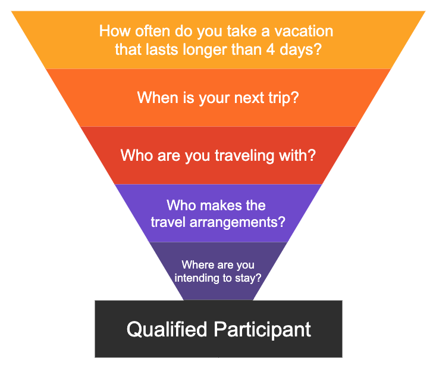

The questions in a screener have two conflicting goals:

 * They must elicit specific information about users.
 * They should also avoid revealing specific information about the study.

**Step 1:** Define the traits of the participant(s) you are looking for

When thinking about the users of your product, you will likely come up with a number of categories of ‘typical’ users. The more specific you can make your descriptions of your users, the better you will be at identifying people who match your user profile. It is important to note that job titles alone don’t fully reflect a person’s tasks, duties, or behaviors. The example below shows how you can turn user traits into screener questions.

| User trait                          | Screener question                                                                                                                                                                                                                                                                                                           |
|-------------------------------------|-----------------------------------------------------------------------------------------------------------------------------------------------------------------------------------------------------------------------------------------------------------------------------------------------------------------------------|
| Takes long vacations                | What is the average duration of your personal trips? {::nomarkdown}<ol type="a"><li>1-2 days</li><li>3-6 days</li><li>7-13 days</li><li>14-20 days</li><li>21+ days</li></ol>{:/}     |
| Takes multiple vacations each year  | How many personal trips have you taken in the past year? {::nomarkdown}<ol type="a"><li>1-2</li> <li>3-6</li> <li>7-10</li><li>12+</li><li>none</li></ol>{:/}                                                                                                                                                                                                                                              |
| Takes vacations with other people   | Who do you travel with on the majority of your personal trips? {::nomarkdown}<ol type="a"><li>I travel solo</li> <li>With friends</li><li>With family</li></ol>{:/}                                                                                                                                                                                                                  |
| Makes all the travel arrangements   | For personal trips, who is responsible for making the travel arrangements (flight, hotel, etc.)? {::nomarkdown}<ol type="a"><li>I am solely responsible</li><li>I share the duties with someone</li><li>Someone else makes the arrangements, but I make the decisions</li><li>Someone else is solely responsible</li></ol>{:/}                                                                 |
| Prefers to stay at high-end resorts | For personal trips, what type of accommodations do you stay at the most? High-end resort (Auburge, Fairmont, etc.) {::nomarkdown}<ol type="a"><li>Budget hotels (Clarion, Comfort In, Motel 6, etc..)</li><li>Mid-price hotels (Tru, Windgate, Hampton Inn, etc.)</li><li>High end hotels (St. Regis, Autograph Collection, etc.)</li><li>Airbnb rentals Vrbo rentals </li><li>Other (text)</li></ol>{:/} |

**Step 2:** Structure the screener like a funnel to narrow down participants, starting with broad questions and moving to more specific questions.

Our screeners are created in Qualtrics. If you don’t have access to Qualtrics, [request it](https://about.gitlab.com/handbook/business-ops/team-member-enablement/onboarding-access-requests/access-requests/). If you are using a different recruiting tool or unmoderated study platform, you will create the screener in those platforms.

**Tips:**

 * Use brackets to indicate if an answer should terminate/reject a respondent.
 * Brackets can also be used to indicate when a question should be skipped.
 * If you need to use advanced logic to display questions and/or route respondents down a certain path based on their previous answers, Qualtrics is a great tool.

**When crafting questions, keep the following in mind:**

 * Ask open-ended questions about behavior, similar to the questions you ask in an interview. Yes/No questions lead participants to assume what you’re looking for.

| Incorrect                                                                                                                             | Correct                                                                                                                                                                                                              |
|---------------------------------------------------------------------------------------------------------------------------------------|----------------------------------------------------------------------------------------------------------------------------------------------------------------------------------------------------------------------|
| Do you take two or more vacations per year?  {::nomarkdown}<ol type="a"><li>Yes [Reject]</li><li>No</li></ol>{:/}           | How many personal vacations do you take per year?{::nomarkdown}<ol type="a"><li>0 [Reject]</li><li>1 [Skip to question 4]</li><li>2 [Reject]</li><li>3 [Reject]</li><li>4+</li></ol>{:/}                        |
| Are you traveling with a partner, friend, or family member?  {::nomarkdown}<ol type="a"><li>No, I’m traveling by myself [Reject]</li><li>Yes, I’m traveling with someone else</li></ol>{:/} | For this upcoming trip, who are you traveling with? {::nomarkdown}<ol type="a"><li>By myself [Reject]</li><li>With my spouse/partner</li><li>With my family (spouse/partner AND kids/external family)</li><li>With a friend</li><li>With a group of friends</li><li>I’m not sure [Reject]</li></ol>{:/} |

 * Provide similar options to choose from to mitigate guessing the purpose of the study.
     * To screen participants for their natural behavior, provide multiple options to mask what you’re looking for.

| Incorrect                          | Correct                                                                                                                                                                                                                                                                                                           |
|-------------------------------------|-----------------------------------------------------------------------------------------------------------------------------------------------------------------------------------------------------------------------------------------------------------------------------------------------------------------------------|
| Where did you purchase your upcoming flight from?  {::nomarkdown}<ol type="a"><li>Priceline  [Skip to question 5]</li><li>Expedia [Reject]</li><li>Other [Reject]</li></ol>{:/}             | Where did you purchase your upcoming flight from? {::nomarkdown}<ol type="a"><li>AlaskaAir.com</li><li>Delta.com [Reject]</li><li>United.com [Reject]</li><li>Priceline.com [Skip to question 5]</li><li>Spirit.com [Reject]</li><li>Expedia.com [Reject]</li><li>Other [Reject]</li></ol>{:/}                                                                                                                                                                                                                       |

 * Use plausible distractor answers to conceal the subject of the study.
 * Avoid stand-out screener options, which indicate behavior that you’re looking for.
     * Participants can look for answers that stand out from the other answer options.
     * Using multi-select can allow for multi-guess without consequence.
 * Multiple correct answers are OK and can provide information about your participants you’d normally get from an interview.

| Incorrect                          | Correct                                                                                                                                                                                                                                                                                                           |
|-------------------------------------|-----------------------------------------------------------------------------------------------------------------------------------------------------------------------------------------------------------------------------------------------------------------------------------------------------------------------------|
| If you needed to get to a meeting on the other side of downtown, about 2 miles away, which of the following would you consider doing to get to your meeting? {::nomarkdown}<ol type="a"><li>Walk</li><li>Hang glide</li><li>Swim</li><li>Crawl</li></ol>{:/}             |If you needed to get to a meeting on the other side of downtown, about 2 miles away, which of the following would you consider doing to get to your meeting? {::nomarkdown}<ol type="a"><li>Walk</li><li>Rent a bike</li><li>Rent a scooter</li><li>Take a Lyft</li></ol>{:/}                                                                                                                                                                                       |

 * If you are looking for a specific behavior, you can ask for verification of that behavior by including a statement in the screener such as “As part of the session, you will be asked to share your screen and walk through a previous hotel reservation.” Give them the option to agree or disagree to share their information.
     * This can guarantee your participant has completed the behavior you are looking for.
     * This is helpful if you need to verify actions or usage to bucket participants into segments.
